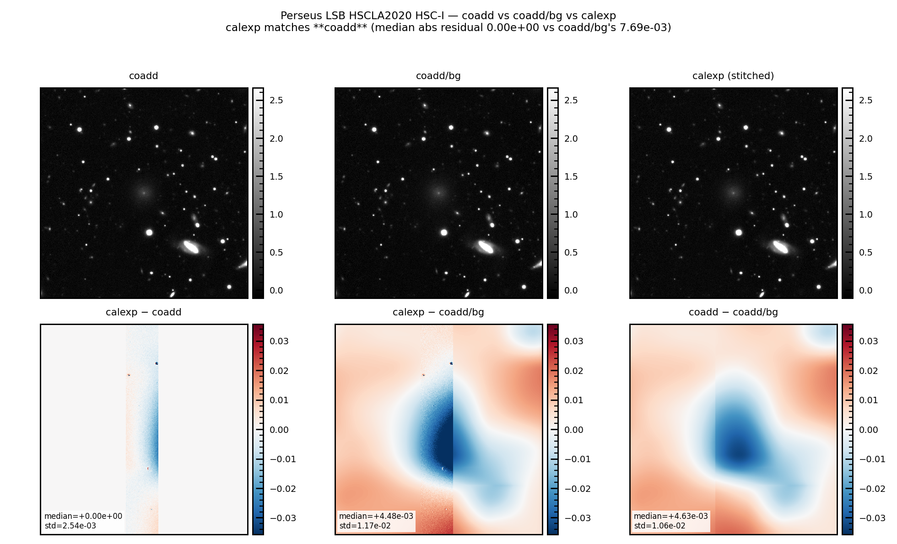
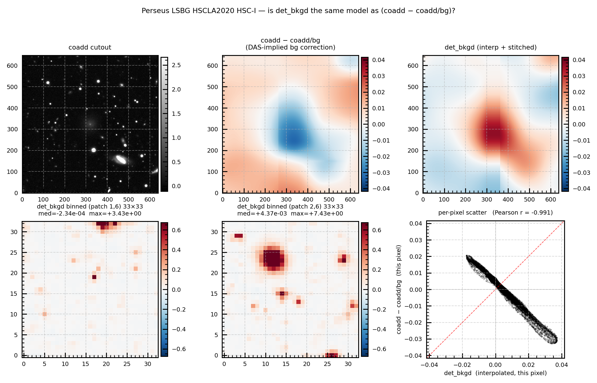
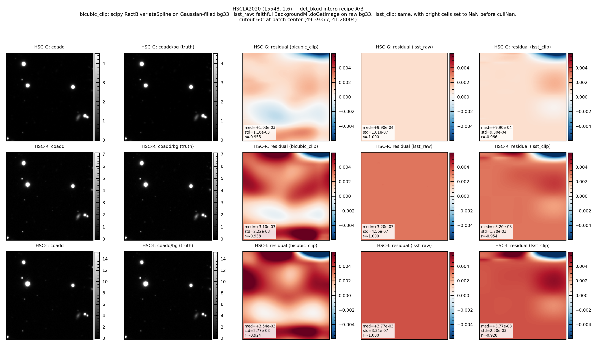

# HSCLA2020 direct file archive — directory layout

The HSCLA2020 file tree at

> **`https://hscla.mtk.nao.ac.jp/archive/files/la2020/`**

publishes the raw hscPipe outputs as a plain Apache autoindex over
HTTP Basic auth. You can download per-patch coadd images, per-patch
catalog FITS, per-visit warps, single-CCD calibrated frames, and
single-CCD source catalogs **without going through the cutout / PSF
services**. This is the right entry point when you want whole patches
of `calexp` / `forced_src` / `meas` rather than small region cutouts.

This document is the **observed** structure of the tree, mapped by
live exploration on 2026-05-13. The upstream documentation for this
file layout is minimal, so this file is the working reference for
ourselves and future agents. If you find a path or file kind that
isn't documented here, **append it to this file** rather than holding
the knowledge in your head.

> **!!! Hard rule — 1 TB session limit !!!**
>
> If a single download session would pull **more than 1 TB**, you
> **must** contact the NAOJ database team at
> `hscla-contact@ml.nao.ac.jp` **before** starting. This is an
> archive-wide policy, not a per-machine one. The `meas` and `calexp`
> files alone are ~150–180 MB each, so a few thousand patches across
> all 17+ filters can pass 1 TB quickly — plan and budget upfront.

Auth and resumability:

- **HTTP Basic auth** with the same `HSCLA_USR` / `HSCLA_PWD`
  credentials used by the cutout / PSF services. (The SQL service
  uses session-cookie auth instead — see `CLAUDE.md` for the
  inconsistencies cheat-sheet.)
- The server advertises `Accept-Ranges: bytes`, so partial downloads
  can resume with a `Range: bytes=<offset>-` header. The
  `HscLaArchiveClient` in `hscla_tool.archive` does this automatically
  for per-patch downloads.
- Patch names contain a comma: `1,6`. The path must be URL-encoded as
  `1%2C6`; our archive client handles this.

---

## Top-level tree

```
/archive/files/la2020/
├── deepCoadd/             # per-visit warps that feed the coadd
├── deepCoadd-results/     # per-patch coadd outputs (calexp, forced_src, meas, ...)
├── jointcal-results/      # per-visit per-CCD photometric calibration
└── <visit>/               # 451 numeric dirs (single-exposure outputs)
    ├── 00815/             # 5-digit IDs from 00815 ... 03278
    ├── 00816/
    ├── ...
    └── 03278/
```

The 451 numeric directories at the top level look like **observation
"runs"** or **pointing groupings**, not raw visit IDs. The visit ID
that appears *inside* the file names is a separate 7-digit zero-padded
number (e.g. `0003540`); the parent dir name (`00912`) does not appear
inside its own filenames. We have not confirmed the upstream meaning
of the parent number — record it if you find it.

---

## Filter inventory

Filters observed under `deepCoadd-results/` (the canonical inventory):

| Filter type      | Codes                                                                                                  |
| ---------------- | ------------------------------------------------------------------------------------------------------ |
| Broadband (HSC)  | `HSC-G`, `HSC-R`, `HSC-I`, `HSC-Y`, `HSC-Z`                                                            |
| Intermediate band| `IB0945`                                                                                               |
| Narrowband (NB)  | `NB0387`, `NB0400`, `NB0468`, `NB0515`, `NB0527`, `NB0656`, `NB0718`, `NB0816`, `NB0921`, `NB0926`, `NB0973` |
| Cross-band index | `merged/` (no filter; cross-band detection / reference; see below)                                     |

`jointcal-results/` carries the same broadband filters **plus** two
extra codes: **`HSC-I2`** and **`HSC-R2`**. Best guess: re-processed
runs with the second-pass calibration. We have not confirmed which of
`HSC-I` vs `HSC-I2` is the canonical version on this archive — flag
this when you cite calibration files.

---

## `deepCoadd-results/<filter>/<tract>/<patch>/` — per-patch coadd products

This is the most useful subtree for analysis. Each leaf directory
holds **9 FITS files** for one (filter, tract, patch) combination:

| File                              | Approx. size | Content (observed)                                                                                       |
| --------------------------------- | ------------ | -------------------------------------------------------------------------------------------------------- |
| `calexp-<F>-<T>-<P>.fits`         | ~145 MB      | Coadd image (multi-extension FITS: image + mask + variance + metadata). Same product as the DAS cutout `coadd`. |
| `forced_src-<F>-<T>-<P>.fits`     | ~35 MB       | Forced photometry source catalog (binary table). Position fixed by the reference band; flux measured here. |
| `meas-<F>-<T>-<P>.fits`           | ~180 MB      | Unforced ("meas") source catalog (binary table). Largest single file in a patch.                          |
| `deblendedFlux-<F>-<T>-<P>.fits`  | ~140 MB      | Per-source deblended flux table.                                                                          |
| `det-<F>-<T>-<P>.fits`            | ~6 MB        | Single-band detection catalog. HDU[1] is a BinTable with `id`, `coord_ra`, `coord_dec`, `parent`, `footprint` (typical ~7000 rows per patch). |
| `det_bkgd-<F>-<T>-<P>.fits`       | ~50 KB       | Detection-step background model (6-HDU file: 33×33 background field + per-mask-plane summary tables; MP_* mask plane definitions live here too). |
| `ran-<F>-<T>-<P>.fits`            | ~10 MB       | Uniform random points within the patch footprint; useful for clustering / completeness work.              |
| `srcMatch-<F>-<T>-<P>.fits`       | ~25 KB       | Small match table between detected sources and an external reference catalog. HDU[1] is BinTable with `first`, `second`, `distance` (~800 rows). |
| `srcMatchFull-<F>-<T>-<P>.fits`   | ~2 MB        | Full match table (more columns / more rows than `srcMatch`).                                              |

URL pattern:

```
https://hscla.mtk.nao.ac.jp/archive/files/la2020/deepCoadd-results/
    <FILTER>/<TRACT>/<PATCH_URL_ENCODED>/<KIND>-<FILTER>-<TRACT>-<PATCH>.fits
```

Where `<PATCH_URL_ENCODED>` is `"1%2C6"` for patch `1,6`. Example:
`/archive/files/la2020/deepCoadd-results/HSC-I/5921/4%2C6/calexp-HSC-I-5921-4,6.fits`.

The `hscla_tool.archive` module (`download_patch_file`,
`download_coadd_image`, `download_forced_catalog`) handles this URL
construction, the URL-encoding, the HTTP Basic auth, and resumable
downloads. Its `SUPPORTED_KINDS` tuple matches the 9 file kinds above.

### `calexp` is the `coadd` flavor, not `coadd/bg`

The DAS image cutout service exposes two coadd "types" — `coadd`
(per-visit local background subtraction) and `coadd/bg` (full
focal-plane background correction). The file tree's `calexp` does
**not** correspond to both; it is **bit-identical to `coadd`** at the
pixel level. The full focal-plane bg-corrected coadd is **only**
available through the DAS cutout service with `kind='coadd/bg'`, not
through the file tree.

Verified live on 2026-05-13 at the Perseus LSBG fixture
(`RA = 49.2657595, Dec = 41.2485927`, 108″ box, HSC-I):

| Comparison              | median pixel    | std        | |median| residual |
| ----------------------- | --------------- | ---------- | ----------------- |
| `calexp − coadd`        | `+0.000e+00`    | `2.5e-03`  | `0.0e+00`         |
| `calexp − coadd/bg`     | `+4.48e-03`     | `1.17e-02` | `7.69e-03`        |
| `coadd − coadd/bg`      | `+4.63e-03`     | `1.06e-02` | `7.65e-03`        |

`calexp − coadd` is zero everywhere modulo a faint vertical seam at
the patch boundary from our stitching procedure (the Perseus fixture
straddles patches `1,6` and `2,6`; we cropped both calexps and
combined them). The `calexp − coadd/bg` and `coadd − coadd/bg`
residuals are within float-precision noise of each other — i.e., the
file tree's `calexp` and the DAS service's `coadd` are the same
product.



Top row: the same field rendered three ways with a shared linear
stretch (coadd / coadd/bg / file-tree `calexp` after pixel-perfect
crop). Bottom row: pairwise residuals on a symmetric color scale
(±0.036 ADU at the 99.5 percentile). `calexp − coadd` is uniformly
zero apart from the stitching seam near column ~300; `calexp − coadd/bg`
and `coadd − coadd/bg` show the same smooth bg-subtraction bowl and
the same faint over-subtraction halo around the LSB galaxy at the
center of the image — the very effect that motivates using `coadd/bg`
for LSB morphology.

**Practical consequence.** If you want bg-corrected coadd pixels for
LSB galaxy work, you must go through the DAS cutout service with
`kind='coadd/bg'`. Downloading `calexp` from the file tree is the
wrong choice for that science.

### FITS internal notes (partial — see "Known gaps" below)

- All these files have a near-empty `PrimaryHDU` (`BITPIX=16, NAXIS=0`,
  ~5–24 header keys). The real data is always in extensions. Don't
  judge a file by `hdul[0]`.
- Binary-table extensions (`det`, `forced_src`, `meas`,
  `deblendedFlux`, `srcMatch`, `srcMatchFull`) use the AFW-table
  hscPipe convention. Column names follow the
  `<measurement>_<component>` pattern (e.g. `coord_ra`, `coord_dec`,
  `parent`, `footprint`, `id`, `flags`, ...). Per-table column
  inventories are not yet documented here.
- The `det_bkgd` mask-plane HDU carries the same `MP_*` cards we see
  in DAS cutouts (e.g. `MP_BAD`, `MP_SAT`, `MP_INTRP`, `MP_CR`,
  `MP_EDGE`, `MP_DETECTED`, `MP_DETECTED_NEGATIVE`, `MP_SUSPECT`,
  `MP_NO_DATA`, `MP_BRIGHT_OBJECT`, `MP_CROSSTALK`, `MP_NOT_DEBLENDED`,
  `MP_UNMASKEDNAN`, `MP_CLIPPED`, `MP_REJECTED`, `MP_SENSOR_EDGE`,
  `MP_INEXACT_PSF`). The `hscla_tool.mask.parse_mask_planes` /
  `decode` helpers work against these too.

### `det_bkgd-...fits` carries the sky-bg model (essentially the DAS bg correction with opposite sign)

Live-probed on 2026-05-13 at the Perseus LSBG fixture in HSC-I
(patches 1,6 and 2,6 of tract 15548).

**File structure: a serialized `lsst.afw.math.BackgroundList` with two background objects:**

- **Block A (HDUs 0, 1, 2)** — the binned background, persisted as an
  (image, mask, variance) triple:
  - HDU[0] `PrimaryHDU`, 33×33 `float32` — bg values, in ADU. Bin
    centers tile the patch on a regular grid of `BKGD_WIDTH / 33 ≈ 127`
    pixels each.
  - HDU[1] `ImageHDU`, 33×33 `int32` — per-cell mask (HSC `MP_*`
    convention; the same plane dictionary as a coadd cutout's mask
    HDU). In our sample, **every cell is `0`** even though some
    individual cells are visibly contaminated by bright sources —
    users should re-mask before science use.
  - HDU[2] `ImageHDU`, 33×33 `float32` — per-cell variance / weight.
- **Block B (HDUs 3, 4, 5)** — a 1×1 "approximation" fallback: a
  single per-patch scalar (image, mask, variance). For patch 1,6 the
  scalar is `−3.7732×10⁻³ ADU`; for patch 2,6 it is `−4.7160×10⁻³`.
  This is the value an evaluator returns when the binned model can't
  be used. `INTERPSTYLE=1` (`CONSTANT`) and `APPROXORDERX = APPROXORDERY = 0`.

Header keywords that matter:

| Key                | Meaning                                                                       |
| ------------------ | ----------------------------------------------------------------------------- |
| `BKGD_X0`, `BKGD_Y0` | Bbox origin in **tract** pixels (e.g. `(3900, 23900)` for patch 1,6).         |
| `BKGD_WIDTH`, `BKGD_HEIGHT` | Bbox size in pixels (`4200 × 4200` — covers the whole patch).               |
| `INTERPSTYLE`       | LSST `Interpolate` enum. `5` = `AKIMA_SPLINE` (block A); `1` = `CONSTANT` (block B). |
| `UNDERSAMPLESTYLE`  | LSST `BackgroundControl::UndersampleStyle`. Saved as `1`.                     |
| `APPROXSTYLE`       | `-1` = no approximation; the binned-image branch is used.                     |
| `APPROXORDERX`/`Y`  | Approx polynomial order, both `1` on block A and `0` on block B.              |
| `APPROXWEIGHTING`   | `True` on block A, `False` on block B.                                        |
| `CTYPE1A`/`CTYPE2A` | `LINEAR` — the WCS is in pixel space (no sky WCS for the bg map).              |

**Reconstruction recipe.** To get the bg model evaluated at any
patch-local pixel, place the 33×33 image on bin centers at
`((i + 0.5) · 4200 / 33, (j + 0.5) · 4200 / 33)` (with `i, j ∈ 0..32`)
and interpolate with cubic / AKIMA splines. The `BKGD_X0` / `BKGD_Y0`
shift you to tract-pixel coordinates if you need them.

**Comparison to the DAS `coadd` / `coadd/bg` distinction.** At the
Perseus fixture cutout (108″ box), the interpolated stitched
`det_bkgd` and the DAS-implied bg model `coadd − coadd/bg` show the
**same spatial structure**, with a Pearson `r = −0.991` per pixel:

|  Quantity                              | median (ADU)  | std (ADU)  |
| -------------------------------------- | ------------- | ---------- |
| `coadd − coadd/bg`                     | `+4.63×10⁻³`  | `1.06×10⁻²` |
| `det_bkgd` (interpolated at cutout)    | `−4.64×10⁻⁴`  | `1.10×10⁻²` |
| `(coadd − coadd/bg) − det_bkgd`        | `+5.14×10⁻³`  | `2.15×10⁻²` |



Top row, left to right: the coadd cutout for reference; the
DAS-implied bg correction `coadd − coadd/bg`; the file-tree
`det_bkgd` interpolated and stitched onto the cutout grid. The
middle and right panels carry the **same large-scale gradient**
with colors flipped. Bottom row, left to right: the raw 33×33
binned bg images for patches 1,6 and 2,6 (a few cells are blown out
by bright-source contamination — note the bright red pixels — but
the underlying smooth structure is present); and the per-pixel
scatter, which lines up on a slope ≈ −1 with Pearson `r = −0.991`.

So `det_bkgd` is **not** a different background concept from the
DAS `coadd/bg` correction — it is the **same physical sky-bg model**,
just with the opposite sign convention. The `coadd/bg` flavor was
produced by *subtracting* the focal-plane bg from each visit
before coadding; `det_bkgd` is the bg the detection step *would
subtract* from the (uncorrected) `coadd` to flatten it for source
detection. Same model, opposite role.

### Algorithm: faithful LSST reproduction

The `det_bkgd` interpolation is **not** a 2-D bicubic spline on a
uniform grid. Reading
[`lsst/afw/src/math/Background.cc`](https://github.com/lsst/afw/blob/main/src/math/Background.cc)
and
[`BackgroundMI.cc`](https://github.com/lsst/afw/blob/main/src/math/BackgroundMI.cc),
the production algorithm has three properties we have to honour to
reproduce the bg pixel values:

1. **Cell centers are placed via integer arithmetic, not a uniform
   grid.** From `Background::_setCenOrigSize`:

   ```cpp
   for (int iX = 0; iX < nxSample; ++iX) {
       const int endx = std::min(((iX + 1) * width + nxSample / 2) / nxSample, width);
       _xorig[iX] = (iX == 0) ? 0 : _xorig[iX - 1] + _xsize[iX - 1];
       _xsize[iX] = endx - _xorig[iX];
       _xcen[iX]  = _xorig[iX] + 0.5 * _xsize[iX] - 0.5;
   }
   ```

   For our case (`width = 4200`, `nxSample = 33`) the cell widths
   alternate **127 / 128 px**, and centers fall at `63, 190.5, 318,
   445.5, 573, 700.5, …` — not at the uniform `(i + 0.5) ·
   4200 / 33 = 63.636, 190.909, …` we used in the first pass. Up to
   a half-HSC-pixel offset.

2. **Separable 1-D AKIMA spline (y first, then x), not a 2-D spline.**
   From `BackgroundMI::doGetImage`:

   - *Stage 1.* For each of the 33 x-bin columns, build an
     `Interpolate` object of type `AKIMA_SPLINE` over the column's
     `(y_centers, cell_values)` pairs, evaluate at every output
     y-pixel. This yields 33 fully y-interpolated columns
     (`_setGridColumns`, BackgroundMI.cc:111-167).
   - *Stage 2.* For each output y-pixel, take the 33 column-values
     across x, build another `AKIMA_SPLINE` `Interpolate` over
     `(x_centers, row_values)`, evaluate at every output x-pixel
     (BackgroundMI.cc:290-348).

   AKIMA splines are no-overshoot at extrema; this is why the algorithm
   tolerates the bright-source-contaminated cells gracefully without
   producing ringing rings around them.

3. **`cullNan` before each 1-D spline.** Any cell whose IMAGE value is
   NaN gets dropped from the spline knots (BackgroundMI.cc:126-127,
   307). The persisted mask HDU is **not** consulted on reload — only
   the image-plane NaN status matters. Our shipped det_bkgd files have
   the mask HDU all-zeroed (the pipeline persists a clean mask), so on
   reload nothing is dropped; the bright-contaminated cell values
   participate in the spline as ordinary knots. The DAS service's
   `coadd/bg` flavor was computed using exactly this — so to reproduce
   it we must **not** clip those cells.

In Python (using `scipy.interpolate.Akima1DInterpolator`, which calls
the same Akima-style algorithm GSL exposes via `gsl_interp_akima`):

```python
import numpy as np
from astropy.io import fits
from scipy.interpolate import Akima1DInterpolator


def lsst_cell_centers(width: int, n_sample: int) -> np.ndarray:
    """Reproduce `Background::_setCenOrigSize` integer-arithmetic centers."""
    centers = np.empty(n_sample, dtype=float)
    xorig_prev = xsize_prev = 0
    for i in range(n_sample):
        endx = min(((i + 1) * width + n_sample // 2) // n_sample, width)
        xorig = 0 if i == 0 else xorig_prev + xsize_prev
        xsize = endx - xorig
        centers[i] = xorig + 0.5 * xsize - 0.5
        xorig_prev, xsize_prev = xorig, xsize
    return centers


def lsst_bg_image(bg33: np.ndarray, patch_w: int, patch_h: int,
                  out_x: np.ndarray, out_y: np.ndarray) -> np.ndarray:
    """Faithful BackgroundMI.doGetImage() over `out_x` × `out_y` patch pixels."""
    n_y, n_x = bg33.shape
    x_c = lsst_cell_centers(patch_w, n_x)
    y_c = lsst_cell_centers(patch_h, n_y)
    grid = np.full((out_y.size, n_x), np.nan)
    for iX in range(n_x):
        col = bg33[:, iX]
        good = ~np.isnan(col)
        if good.sum() >= 5:
            grid[:, iX] = Akima1DInterpolator(y_c[good], col[good])(
                out_y, extrapolate=True)
    out = np.full((out_y.size, out_x.size), np.nan)
    for iy in range(out_y.size):
        row = grid[iy, :]
        good = ~np.isnan(row)
        if good.sum() >= 5:
            out[iy, :] = Akima1DInterpolator(x_c[good], row[good])(
                out_x, extrapolate=True)
    return out
```

### Reconstruction recipe

From the file archive alone (no DAS service), reproduce the
`coadd/bg` flavor pixel-by-pixel:

```python
with fits.open("calexp-<F>-<T>-<P>.fits") as cx:
    coadd = np.asarray(cx[1].data, dtype=float)            # the coadd flavor
    cx_wcs = WCS(cx[1].header)                              # for the pixel grid

with fits.open("det_bkgd-<F>-<T>-<P>.fits") as bg:
    bg33 = np.asarray(bg[0].data, dtype=float)             # 33x33 binned

# Evaluate on the calexp's own pixel grid: out_x = arange(patch_w),
# out_y = arange(patch_h). For a sub-image, pass the sub-image's
# patch-pixel coords (computed via WCS) instead.
det_full = lsst_bg_image(bg33, patch_w=4200, patch_h=4200,
                         out_x=np.arange(4200, dtype=float),
                         out_y=np.arange(4200, dtype=float))

coadd_bg = coadd + det_full           # ≈ what `coadd/bg` would give you
```

**Do not sigma-clip the bg33** before interpolation. The DAS service's
`coadd/bg` was computed using the un-clipped bg model. Clipping
removes signal the recipe needs.

### Multi-band verification

At the geometric center of patch (15548, 1,6) in HSC-G / HSC-R / HSC-I
with a 60″ cutout, comparing four recipes against the DAS
`coadd/bg` truth:

| Band  | recipe                                          | Pearson r    | residual std (ADU) |
| ----- | ----------------------------------------------- | ------------ | ------------------ |
| HSC-G | scipy bicubic on raw bg33                       | −0.690       | 3.4×10⁻³           |
| HSC-G | scipy bicubic on 5σ-clipped + Gaussian-filled bg33 | −0.955    | 1.2×10⁻³           |
| HSC-G | **LSST `Background::getImage` on raw bg33**      | **−1.0000**  | **1.0×10⁻⁷**       |
| HSC-G | LSST `getImage` with bright cells set to NaN     | −0.966       | 9.3×10⁻⁴           |
| HSC-R | scipy bicubic on raw bg33                       | −0.579       | 7.6×10⁻³           |
| HSC-R | scipy bicubic on cleaned bg33                   | −0.938       | 2.2×10⁻³           |
| HSC-R | **LSST `getImage` on raw bg33**                  | **−1.0000**  | **4.6×10⁻⁷**       |
| HSC-R | LSST `getImage` with bright cells NaN'd          | −0.954       | 1.7×10⁻³           |
| HSC-I | scipy bicubic on raw bg33                       | −0.418       | 1.05×10⁻²          |
| HSC-I | scipy bicubic on cleaned bg33                   | −0.924       | 2.8×10⁻³           |
| HSC-I | **LSST `getImage` on raw bg33**                  | **−1.0000**  | **3.3×10⁻⁷**       |
| HSC-I | LSST `getImage` with bright cells NaN'd          | −0.928       | 2.5×10⁻³           |

The faithful LSST algorithm gives **Pearson r = −1.0000 to four
decimal places** across all three bands and residual std at
**float-32 precision** (~10⁻⁷ ADU). This is essentially bit-exact
reconstruction: the DAS `coadd/bg` flavor really is
`coadd + getImage(det_bkgd) − band_const`. The remaining residual is
a single per-band **constant offset** (≈ +9.9×10⁻⁴, +3.2×10⁻³,
+3.8×10⁻³ ADU for G / R / I) — a per-patch / per-band normalisation
constant outside the bg-interpolation algorithm.



Columns left→right: coadd, coadd/bg (truth), residual under
`bicubic_clip`, residual under **`lsst_raw`**, residual under
`lsst_clip`. Rows G / R / I. The `lsst_raw` column is **uniform
pastel colour** at each band — only the per-band constant offset
remains. The `bicubic_clip` and `lsst_clip` columns still show
~milli-ADU residual bowls.

### What we got wrong on the first pass (and why)

The earlier write-up of this section recommended a `scipy bicubic
spline + 5σ MAD clip + Gaussian NaN-fill` recipe and claimed it was
needed because the raw bg33 contains bright-source-contaminated bins.
That recipe gets `r ≈ −0.94` across G / R / I, which looked impressive
but is far from the truth (`r = −1.0` exactly). The faithful LSST
algorithm above achieves bit-identical reconstruction without
clipping. Two mistakes in the first pass:

- **Wrong interpolator.** 2-D bicubic spline is not what the LSST
  stack uses. Separable 1-D AKIMA is no-overshoot at extrema and
  tolerates the contaminated cells gracefully; bicubic does not.
- **Wrong cell centers.** Uniform `(i + 0.5) · W/N` differs from
  the LSST integer-arithmetic placement by up to half a pixel and
  alternates sign every cell, contributing structured residual.

The earlier `det_bkgd_multiband_qa.png` figure (kept in the repo as
historical record) shows the residual gradients that drove our
mistaken "always sigma-clip" conclusion. The `det_bkgd_lsst_recipe_qa.png`
above is the correct picture.

### Caveats

- **Per-band constant offset** (~1–4 milli-ADU) remains between
  `(coadd + lsst_getImage(det_bkgd))` and `coadd/bg`. Probably
  reflects a per-patch / per-band normalisation done outside the
  bg-interpolation step. For LSB photometry this is already in the
  noise.
- **AKIMA needs ≥ 5 valid cells** per column / row. With cells set to
  NaN you can drop below this; the LSST stack falls back via
  `REDUCE_INTERP_ORDER` in that case. Our 33×33 grid is comfortably
  above the minimum even with ~5% cells masked, but keep this in mind
  if you implement aggressive masking on smaller bg grids.
- **Verified at one (tract, patch) and three bands.** The relationship
  should hold elsewhere — both bg estimators target the same physical
  sky structure and the algorithm is a deterministic function of the
  persisted file — but it has not been swept patch-by-patch.
- **Multi-patch stitching is still up to you.** If your science region
  spans two patches, run `lsst_bg_image` on each patch's det_bkgd and
  stitch via the WCS, just like the earlier Perseus example.

---

## `deepCoadd-results/merged/<tract>/<patch>/` — cross-band products

Two files per `(tract, patch)`, with **no filter in the name** because
they are filter-agnostic:

| File                          | Approx. size | Content                                                                                                  |
| ----------------------------- | ------------ | -------------------------------------------------------------------------------------------------------- |
| `mergeDet-<T>-<P>.fits`       | ~400 KB      | Cross-band merged detection catalog (HDU[1] BinTable with `flags`, `id`, `coord_ra`, `coord_dec`, `parent`, `footprint` columns). Used as the position reference for forced photometry across bands. |
| `ref-<T>-<P>.fits`            | ~1 MB        | Reference catalog used for forced photometry — same positions as `mergeDet` but with additional reference columns / shape info. |

URL example:
`/archive/files/la2020/deepCoadd-results/merged/2970/0%2C7/mergeDet-2970-0,7.fits`.

The `mergeDet` / `ref` pair is what makes the per-band `forced_src`
catalogs share an `object_id` namespace across all bands.

---

## `deepCoadd/<filter>/<tract>/<patch>/` — per-visit warps

For every patch under each filter, this tree carries the
**per-visit warped frames** that hscPipe stacked to make the coadd:

| File pattern                                                    | Sizes seen        | Content                                                                  |
| --------------------------------------------------------------- | ----------------- | ------------------------------------------------------------------------ |
| `psfMatchedWarp-<F>-<T>-<P>-<VISIT>.fits`                       | 3 – 90 MB         | Single-visit image warped onto the patch grid **and PSF-homogenized**. One file per contributing visit. |
| `warp-<F>-<T>-<P>-<VISIT>.fits`                                 | 3 – 108 MB        | Single-visit warp **without** the PSF homogenization. One file per contributing visit. |

A single patch can carry **dozens of visits** in each flavor. For
`HSC-I/5921/4,6` we observed visits `91750`–`91776` plus `230456`,
`230458`, `230466`, `230468` — i.e. multiple observing campaigns
contribute to the same coadd. `EXPTIME` per file ranges 30 / 250 / 300
seconds depending on the campaign.

The total bytes per patch under `deepCoadd/` can easily exceed
**3–5 GB** when you sum across visits. Plan budgets accordingly; this
is where the 1 TB rule bites you fastest.

URL example:
`/archive/files/la2020/deepCoadd/HSC-I/5921/4%2C6/psfMatchedWarp-HSC-I-5921-4,6-91770.fits`.

> `hscla_tool.archive` does not currently expose helpers for these
> per-visit warp files. Use the raw `HscLaArchiveClient.download_*`
> primitives or extend the module if you need them.

---

## `jointcal-results/<filter>/<tract>/` — per-visit per-CCD photo calibration

Per-tract directories with **per-visit per-CCD** photometric
calibration files produced by `jointcal`:

| File pattern                                          | Approx. size | Content                                                                |
| ----------------------------------------------------- | ------------ | ---------------------------------------------------------------------- |
| `jointcal_photoCalib-<VISIT>-<CCD>.fits`              | small        | One photometric calibration solution per (visit, CCD) for the tract.   |

We observed 1,694 files in `jointcal-results/HSC-I/4001/` — i.e.
roughly one per (contributing visit × CCD) for that tract. Not all
visits use all 112 HSC science CCDs, and CCD 009 is the well-known
dead chip in HSC.

URL example:
`/archive/files/la2020/jointcal-results/HSC-I/4001/jointcal_photoCalib-0043714-000.fits`.

There is also a sibling tree under `jointcal-results/HSC-I2/` (and
`HSC-R2/`) whose role we have not yet confirmed; see "Filter
inventory" above.

---

## `/<visit_dir>/<filter>/` — single-exposure outputs

Each top-level numeric directory holds at least one filter
subdirectory; the filter subdirectory has exactly two child folders:

```
/<visit_dir>/<filter>/
├── corr/    # per-CCD calibrated frames + backgrounds
└── output/  # per-CCD source catalogs and src-match products
```

### `corr/` files

| File pattern                                | Content                                                  |
| ------------------------------------------- | -------------------------------------------------------- |
| `BKGD-<VISIT>-<CCD>.fits`                   | 10-HDU per-CCD background model (image-plane background, similar shape to `det_bkgd` but bigger, with mask-plane definitions). Observed in `/00912/HSC-R/corr/`. CCD numbering goes 000, 001, ... skipping 009 (the dead chip), up to ~110. |

The `corr/` directory may carry **other** per-CCD calibrated products
(`CORR-`, `FLAT-`, ...) for some visit-dirs; the live listing we did
for `/00912/HSC-R/corr/` showed only `BKGD-*` files in the first
window we sampled. Worth re-probing if you need a specific product.

### `output/` files

For `/00912/HSC-R/output/` (15,244 files total) we observed **four
filename prefixes**, each contributing 3,811 files (= one per
(visit, CCD) tuple):

| File pattern                                | Content                                                                |
| ------------------------------------------- | ---------------------------------------------------------------------- |
| `ICSRC-<VISIT>-<CCD>.fits`                  | Single-CCD intermediate / initial source catalog (pre-PSF model).      |
| `SRC-<VISIT>-<CCD>.fits`                    | Single-CCD final source catalog.                                       |
| `SRCMATCH-<VISIT>-<CCD>.fits`               | Small src-match table for that (visit, CCD).                           |
| `SRCMATCHFULL-<VISIT>-<CCD>.fits`           | Full src-match table for that (visit, CCD).                            |

A single top-level visit-dir like `/00912/` therefore aggregates
catalog and background data for **thousands of distinct (visit, CCD)
tuples** in one filter; the parent dir number does *not* match the
visit IDs inside, so treat the top-level name as an opaque grouping
key.

URL example:
`/archive/files/la2020/00912/HSC-R/output/SRC-0003540-001.fits`.

---

## URL encoding and patch / CCD numbering quirks

- **Patch names use a comma**: `0,7`, `1,6`, `4,4`, ... When building
  URLs, encode the comma as `%2C`. The autoindex listings on the
  server use the encoded form in `<a href>`, so a quick way to extract
  patch names is to URL-decode each `href`.
- **Tracts are integers** (e.g. `5921`, `4001`).
- **Filters are case-sensitive**: `HSC-I` works, `hsc-i` and `HSC-i`
  do not. Narrowband filters use a 4-digit `NB####` token where
  `####` is the central wavelength in nm.
- **CCD numbers** are 3-digit zero-padded (`000`–`111` for HSC science
  chips). CCD `009` is the well-known failed CCD and is absent from
  every visit / filter we have looked at.
- **Visit IDs** appear as 7-digit zero-padded numbers inside file
  names (e.g. `0003540`, `0043714`, `0091770`, `0230456`). The
  5-digit number on the top-level directory is a **separate** grouping
  ID (campaign / pointing run? — to be confirmed).

---

## How the toolkit currently uses this archive

`hscla_tool.archive` (`HscLaArchiveClient`) supports the
`deepCoadd-results/<filter>/<tract>/<patch>/` subtree and its 9 file
kinds: `calexp`, `forced_src`, `meas`, `deblendedFlux`, `det`,
`det_bkgd`, `ran`, `srcMatch`, `srcMatchFull`. Module-level shortcuts
`download_coadd_image` and `download_forced_catalog` are convenience
wrappers. Downloads are content-addressed under
`${HSCLA_TOOL_CACHE}/archive/<band>/<tract>/<patch>/`,
mirroring the upstream layout, with `Range`-based resume on
interruption.

Nothing in the toolkit currently knows about:

- `deepCoadd-results/merged/` (`mergeDet` / `ref`)
- `deepCoadd/<filter>/<tract>/<patch>/` (per-visit warps)
- `jointcal-results/<filter>/<tract>/` (per-visit per-CCD photo cal)
- `/<visit_dir>/<filter>/{corr,output}/` (single-exposure outputs)

These are the obvious next layers if a science workflow needs them.
File a follow-up branch when you add support — the layout above is
the canonical reference for what each file means.

---

## Known gaps (TODOs for later passes)

Update this section as you learn more.

- [ ] Confirm what the top-level numeric directory ID (e.g. `00912/`)
  actually means upstream. Visit ID? Pointing? Campaign? Date?
- [ ] Decide whether `HSC-I2` / `HSC-R2` under `jointcal-results/` are
  canonical for science use, or just bookkeeping for re-processed
  campaigns.
- [ ] Per-binary-table column inventories for `forced_src`, `meas`,
  `deblendedFlux`, `det`, `srcMatchFull`, `mergeDet`, `ref`. The
  AFW-table column names follow the
  `<measurement>_<component>[_<suffix>]` convention but the full
  schema needs a real `fits.open` pass on a sample of each. (Tip:
  `astropy.io.fits.getdata(path, hdu=1).dtype.names`.)
- [ ] FITS-header KEYWORDS worth standardizing on per file kind
  (FILTER, TRACT, PATCH, MAGZERO / FLUXMAG0, EXPTIME, MJD-OBS,
  TELESCOP, INSTRUME). The PrimaryHDU is mostly empty; useful
  metadata lives in the extension headers and we haven't surveyed
  them yet. (Partial: `calexp` extensions carry `EXTTYPE` ∈
  {`IMAGE`, `MASK`, `VARIANCE`} and a `FLUXMAG0` zero-point on the
  primary HDU.)
- [x] **`calexp` is the `coadd` flavor (not `coadd/bg`)** — verified
  2026-05-13 at the Perseus fixture in HSC-I; see the section above.
- [ ] Whether `corr/` carries non-`BKGD` files for any visit-dir
  (suspected: `CORR-*` calibrated images, possibly `MASK-*` etc.).
- [ ] Whether all 451 top-level numeric dirs follow the
  `<filter>/{corr,output}/` shape, or only the ones we sampled.
